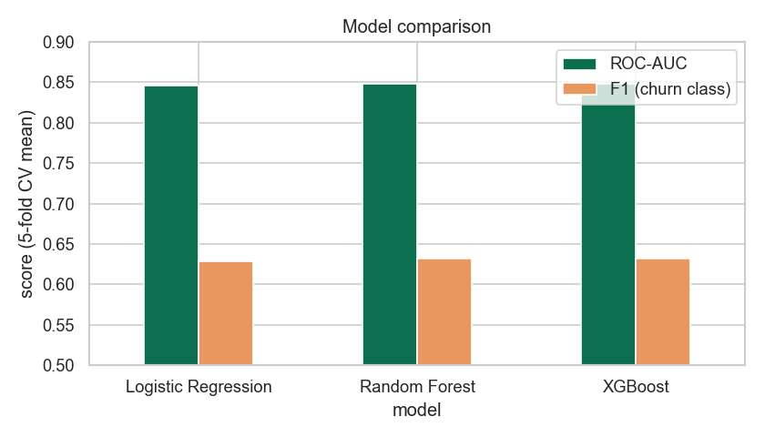
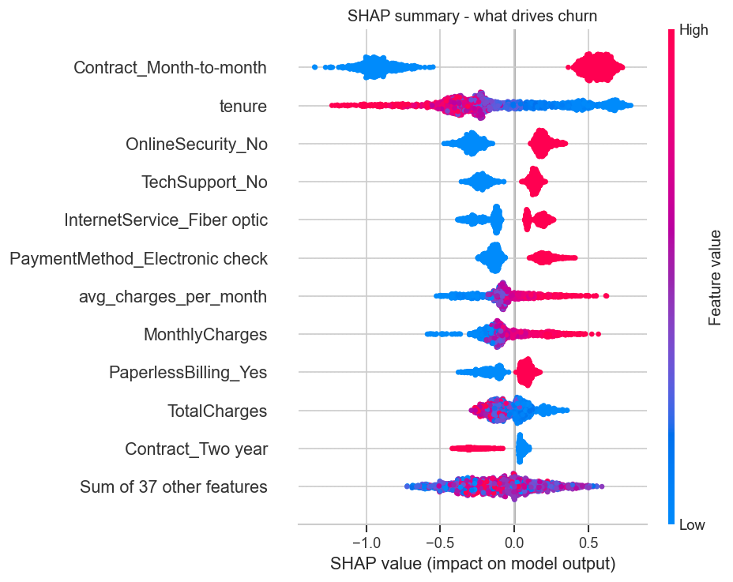

# Churn Prediction

A small project that predicts which telecom customers are likely to cancel, and
explains why. It uses the Telco Customer Churn dataset (about 7,000 customers),
compares a few models, and ships a Streamlit app you can click around in.

Live demo: https://churn-prediction-gkwwmqybjgyutypa3d44ys.streamlit.app

I built this to practice a full tabular ML workflow: cleaning the data,
engineering features, comparing models with cross-validation, tuning the
decision threshold for an imbalanced target, and explaining predictions with
SHAP.

## What it does

- Cleans the raw data. The TotalCharges column ships as text with a few blank
  values (new customers at tenure 0), so those get flagged and filled.
- Engineers a few features: tenure buckets, charge ratios, and a flag for the
  missing values.
- Trains three models (logistic regression, random forest, XGBoost) with 5-fold
  stratified cross-validation.
- Tunes the decision threshold on out-of-fold predictions instead of leaving it
  at 0.5, which matters when only about a quarter of customers churn.
- Explains the model with SHAP, both overall and for a single customer in the app.

## Results

The three models finish close together, around 0.85 ROC-AUC on a held-out test
set:

- Logistic regression: 0.842
- Random forest: 0.845
- XGBoost: 0.846

I ship XGBoost. It has the best held-out score, and being tree-based it gives
exact SHAP explanations. After tuning the threshold to about 0.57 it gets
precision 0.56, recall 0.75 and F1 0.64 on the churn class, which catches a lot
more churners than the default 0.5 cutoff.

One honest note about the number: on a clean split this dataset tops out around
0.85 ROC-AUC. Scores much higher than that usually mean something leaked between
train and test (scaling or resampling before the split, or scoring on training
data), so I kept the pipeline strict and reported the real held-out numbers.



## What drives churn

SHAP points at contract type and tenure as the two biggest factors, followed by
online security, tech support, internet service and payment method.



A few retention ideas that fall out of it:

- Month-to-month customers churn the most, so moving them onto a longer contract
  is the obvious lever.
- The first year is the risky one, so early onboarding and support help.
- Bundling tech support or online security tends to keep people around.
- Electronic-check payers churn more than people on auto-pay.

## Run it locally

```bash
git clone https://github.com/Kirill-Streltsov/churn-prediction.git
cd churn-prediction

python3.12 -m venv .venv && source .venv/bin/activate
pip install -r requirements.txt
pip install -e .

streamlit run app.py
```

On macOS XGBoost needs the OpenMP runtime, so run `brew install libomp` first if
you hit a library-loading error.

To retrain the model and regenerate the figures:

```bash
python scripts/train.py
python scripts/make_figures.py
```

## Tests

```bash
pip install -r requirements-dev.txt
pytest
```

## Layout

```
app.py         Streamlit app (predict, EDA, model comparison, SHAP)
churn/         the pipeline: config, data, features, model, explain
notebooks/     analysis notebooks (EDA, features, modeling, SHAP)
scripts/       train, tune and figure-generation scripts
tests/         unit tests
```
